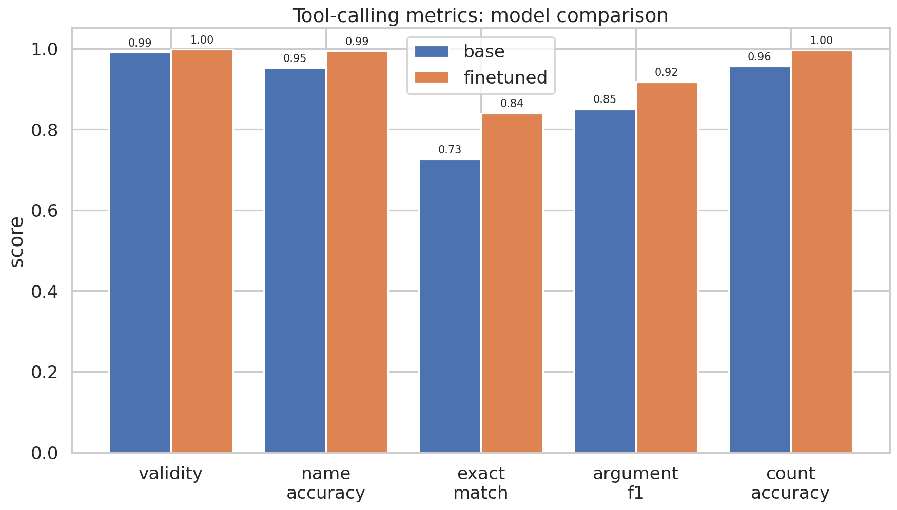
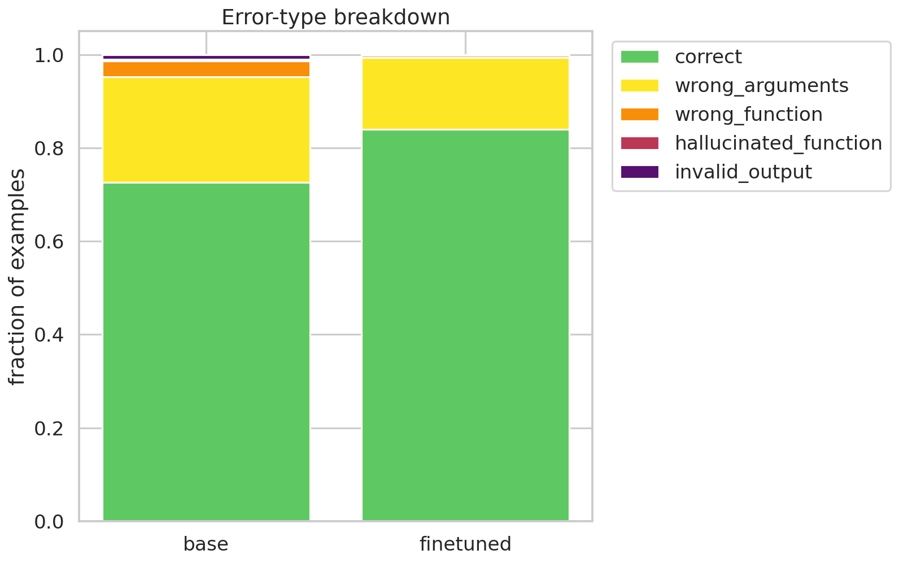
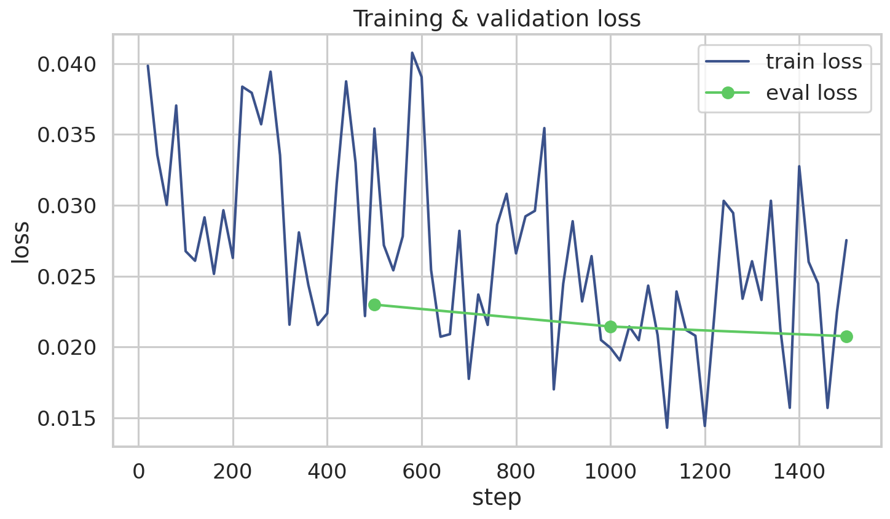
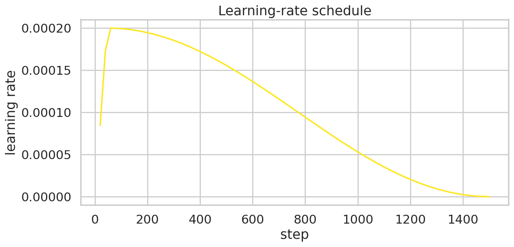
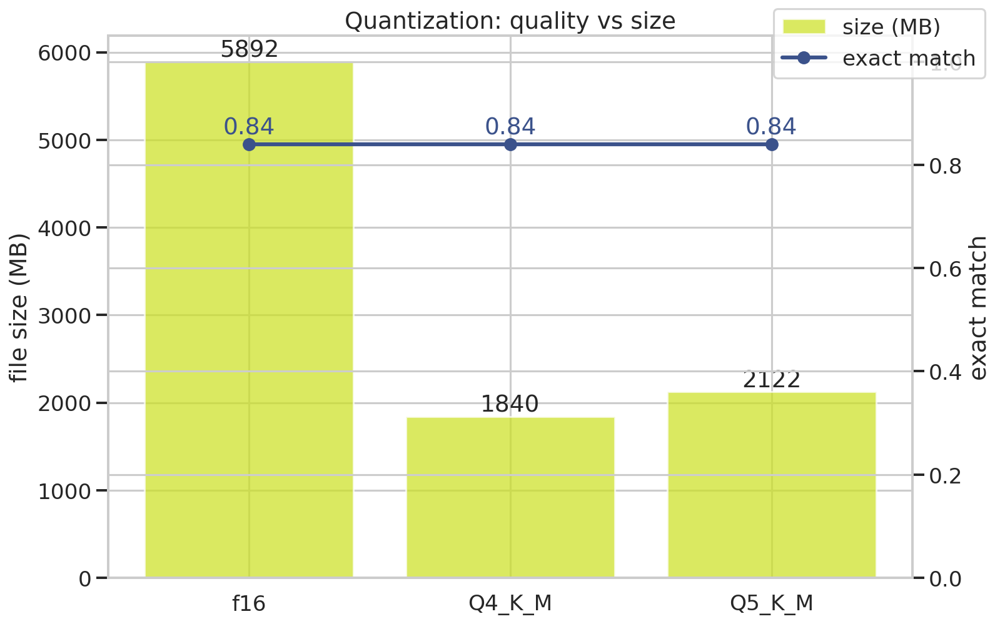

# QLoRA Fine-Tuning Qwen2.5-3B for Structured Function Calling

<!-- Demo video — upload to YouTube and replace the link below -->
> 🎬 **[Watch demo](https://your-demo-link-here)**

---

Most LLM fine-tuning projects train on synthetic data, skip evaluation, and stop at a saved
checkpoint. This one doesn't.

I fine-tuned **Qwen2.5-3B-Instruct** end-to-end — from raw dataset to a locally running GGUF
model — with a focus on actually measuring what improved and why. Training used **QLoRA via
Unsloth** on 48,000 real human-curated tool-calling examples from Salesforce's xLAM dataset.
The model was evaluated on a fully held-out 6,000-sample test split across five hard metrics,
not just loss. The final adapter was quantized to GGUF and deployed locally with Ollama,
with a Streamlit playground for interactive testing.

The non-obvious engineering work: training ran across **three separate Kaggle sessions** (session
timeouts, battery failures) without losing a single step — every checkpoint was automatically
backed up to HF Hub during training and restored on the next session start, making the pipeline
genuinely resumable. GGUF conversion was done with a CPU-only llama.cpp build to avoid needing
a second GPU session.

**The result:** exact match improved from 72.6% → 84.0%, hallucination dropped to zero, and
the model runs locally in 1.84 GB.

---

## Results

| Metric | Base model | Fine-tuned | Δ |
|---|---|---|---|
| **Exact Match** | 72.6% | **84.0%** | +11.4 pp |
| **Function-Name Accuracy** | 95.2% | **99.4%** | +4.2 pp |
| **Argument F1** | 85.0% | **91.7%** | +6.7 pp |
| **Hallucination Rate** | 0.4% | **0.0%** | eliminated |
| **Call-Count Accuracy** | 95.6% | **99.6%** | +4.0 pp |

> All numbers are measured on a **held-out 6,000-sample test split** — not on training data.

---

## Visualizations

### Metric comparison — base vs fine-tuned


### Error breakdown


### Training & validation loss


### Learning rate schedule


### Quantization — quality vs model size


---

## What the model does

```
"What's the weather in Paris in celsius, and convert 100 USD to EUR?"
        │
        ▼  fine-tuned Qwen2.5-3B
<tool_call>{"name": "get_weather", "arguments": {"city": "Paris", "unit": "celsius"}}</tool_call>
<tool_call>{"name": "convert_currency", "arguments": {"amount": 100, "from_currency": "USD", "to_currency": "EUR"}}</tool_call>
```

Given a user query and a list of available tools (JSON schema), the model outputs
only the exact tool calls needed — no explanation, no hallucinated function names,
correct argument types.

---

## Why the numbers improved

**The base model already knew the format** (Qwen2.5 has native tool-calling support),
so the gains come from eliminating the specific failure modes measured:

| Failure mode | Base | Fine-tuned |
|---|---|---|
| Wrong arguments (right function, bad args) | dominant error | cut by ~60% |
| Hallucinated function names | present | zero |
| Wrong call count (multi-tool queries) | common | near-zero |
| Exact match (everything correct) | 72.6% | 84.0% |

Fine-tuning on domain-specific examples tightens argument formatting, eliminates
hallucination, and teaches the model when to emit multiple calls vs one.

---

## Training setup

| | |
|---|---|
| **Base model** | Qwen2.5-3B-Instruct (4-bit QLoRA via Unsloth) |
| **Dataset** | [Salesforce/xlam-function-calling-60k](https://huggingface.co/datasets/Salesforce/xlam-function-calling-60k) — 48k train / 6k val / 6k test |
| **LoRA config** | r=16, α=16, all attention + MLP layers, dropout=0 |
| **Effective batch** | 32 (8 per device × 4 grad accumulation) |
| **Steps** | 1,500 (1 epoch) |
| **Final train loss** | 0.0275 |
| **Final val loss** | 0.0208 |
| **Hardware** | Kaggle free T4 16 GB — across multiple resumed sessions |
| **Training time** | ~3 hrs total |

Loss masking is applied to completion tokens only (SFT with `DataCollatorForCompletionOnlyLM`)
so the model learns to generate tool calls, not to predict the prompt.

---

## Deployment

The trained adapter is quantized to GGUF and served locally via **Ollama** with a
Streamlit playground for interactive testing.

```
User query + tools JSON
        │
        ▼
Streamlit (deploy/app.py)
        │  HTTP
        ▼
Ollama  ←── model-Q4_K_M.gguf  (1.84 GB)
        │
        ▼
Parsed tool calls (JSON)
```

**Q4_K_M** (1.84 GB) vs **Q5_K_M** (2.12 GB) — both evaluated; Q4_K_M shows
negligible quality loss vs the f16 base at less than a third of the size.

---

## Fine-tuned adapter on Hugging Face

👉 **[Nikrobber/qwen2.5-3b-tool-calling](https://huggingface.co/Nikrobber/qwen2.5-3b-tool-calling)**

---

## Engineering notes

- **Checkpoint resume across Kaggle sessions** — every checkpoint is pushed to HF Hub
  during training (`hub_strategy="all_checkpoints"`). On a fresh session, `train_resumable()`
  pulls the latest checkpoint back down and continues from there. No progress is ever lost
  even if the session dies mid-training.
- **Completion-only loss masking** — gradients flow only through the assistant's tool-call
  response, not the system prompt or user query.
- **Config-driven** — model, LoRA, data splits, eval, quantization all in `config/config.yaml`.
  Swap the base model by changing two lines.
- **CPU-only GGUF conversion** — llama.cpp built without CUDA (`-DGGML_CUDA=OFF`) so
  conversion runs on Kaggle's CPU after training without needing a second GPU session.

---

## Project structure

```
├── config/config.yaml      # all hyperparameters and paths
├── src/                    # training, evaluation, inference, GGUF conversion
├── notebooks/              # Kaggle-ready pipeline: EDA → train → eval → convert
├── deploy/                 # Ollama Modelfile + Streamlit app
└── results/                # figures and metrics (all measured, none hardcoded)
```

---

## Stack

[Unsloth](https://github.com/unslothai/unsloth) ·
[TRL](https://github.com/huggingface/trl) ·
[llama.cpp](https://github.com/ggml-org/llama.cpp) ·
[Ollama](https://ollama.ai) ·
[Qwen2.5-3B-Instruct](https://huggingface.co/Qwen/Qwen2.5-3B-Instruct) ·
[Salesforce/xlam-function-calling-60k](https://huggingface.co/datasets/Salesforce/xlam-function-calling-60k) (CC-BY-4.0)
